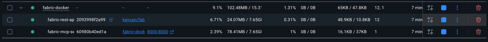
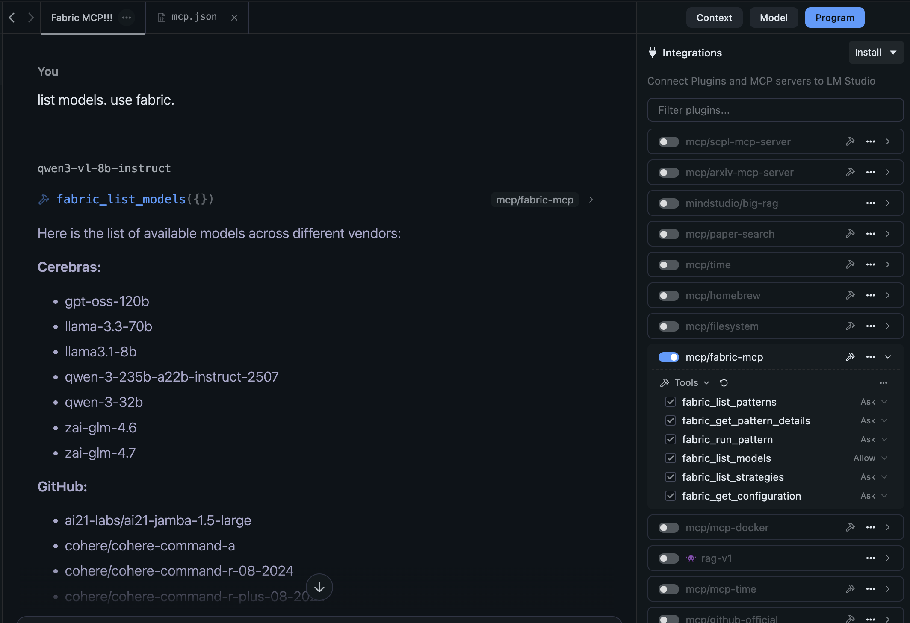

# docker-compose-fabric-ai
Use `fabric-ai`'s `REST API` and `MCP server` inside `Docker` containers and manage with `docker compose`

# Purpose

Fabric is already an amazing tool for maximizing and optimizing the use of AI through the Fabric CLI. This is taken even further when given as tools for an LLM itself. The goal is to utilize these tools safely in containers, via [Docker CLI](https://www.docker.com/products/cli/).

It can become quite a hassle to have to manage your fabric server REST API instance along with configuring the MCP server. While it technically is easier to set it and forget, there are some noticeable improvements:

1. We run a fabric server inside a docker container, not on your local machine for better security. This is where the main event occurs.
2. We run the fabric MCP server inside a docker container, not on your local machine; this significantly improves security, and is generally still the best practice with MCP servers.
3. Managing the REST API and MCP server with `docker compose` makes building, starting, and stopping them a breeze; everything is connected within a docker network as well (or even a Tailscale network if you wanted to; see [Tailscale with Docker](https://tailscale.com/kb/1282/docker)).

In this repo, I will guide you through the installation process, configuration, usage, and degrees of freedom.

## Previews

  



# Installation

## Installation (for Mac users)
### Requirements
- `docker` and `docker-compose`
If you use Homebrew:

```brew install docker docker-compose```

1. Clone this repository:

```git clone https://github.com/q8xj9gs8hs-a11y/docker-compose-fabric-ai.git && cd q8xj9gs8hs-a11y/docker-compose-fabric-ai```

2. Create fabric configuration setup

```docker run -it --rm kayvan/fabric -S```

4. Docker compose up

```docker compose --project-directory q8xj9gs8hs-a11y/fabric-docker up -d```

5. Add to your MCP client

```json
{
  "mcpServers": {
    "fabric-mcp": {
      "url": "http://localhost:8000/message"
    }
  }
}
```

# Usage

### All examples will be using:
- [LM Studio](https://lmstudio.ai) as the MCP client
- [Cerebras AI](https://www.cerebras.ai) as Fabric's vendor
